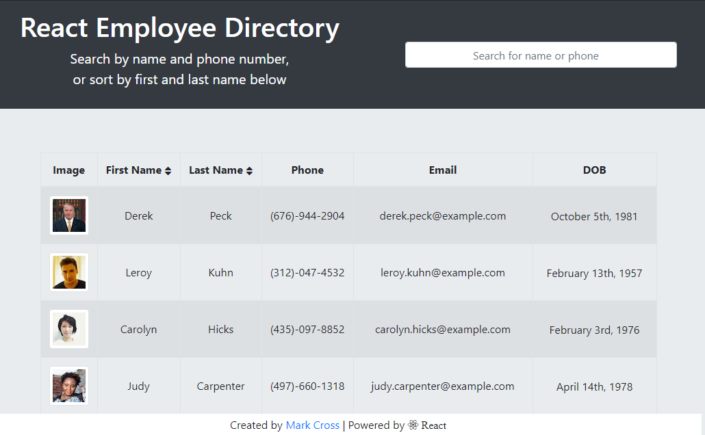
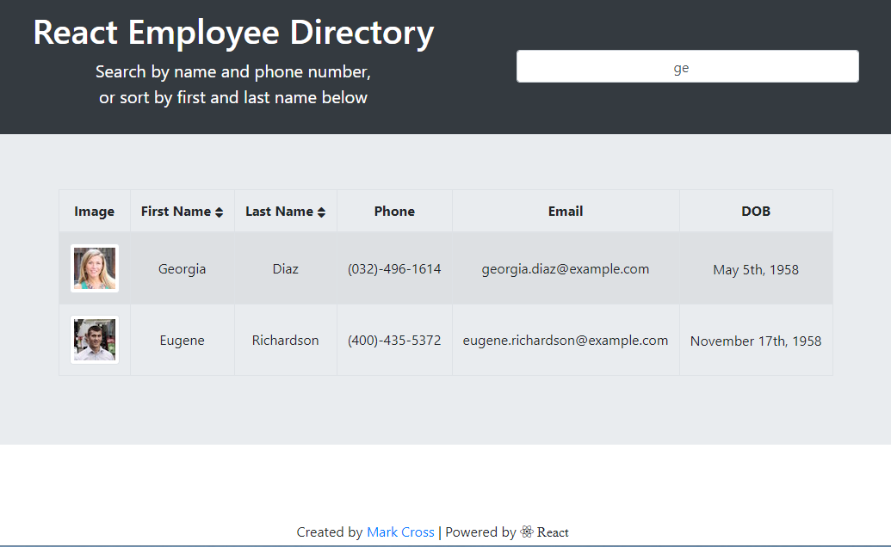

# [React Employee Directory](https://wonderful-wiles-5374b9.netlify.app)

---

## Description

An employee or manager would benefit greatly from being able to view non-sensitive data about other employees. It would be particularly helpful to be able to filter employees by name. This employee directory allows you to do that and more. Built with React, the page makes an API call to the [Random User API](https://randomuser.me/) to populate the employee data. That data can then be sorted by first or last name, ascending or descending, alphabetically. You can also search the list by first name, last name, or phone number.

---

## **Table of Contents**

- 
  - [Description](#description)
  - [**Table of Contents**](#table-of-contents)
  - [Installation](#installation)
  - [Technologies](#technologies)
  - [Usage](#usage)
  - [License](#license)
  - [Contributing](#contributing)
    - [Contributor Covenant Code of Conduct](#-contributor-covenant-code-of-conduct)
  - [Tests](#tests)
  - [Questions](#questions)

---

## Installation

1. Clone the repo
2. Install NPM packages: `npm i`

---

## Technologies

1. React.js
2. React-router-dom
3. React-bootsrap
4. Context API
5. Axios
6. Moment
7. React Hooks (useState, useEffect)
8. Javascript
9. HTML/CSS

---

## Usage

---

## License

Licensed under the [MIT](https://github.com/markdcross/react-employee-directory/blob/b84023c257e284259ceb7eacb8bfc70fdbff0947/LICENSE) license.

---

## Contributing

#### [Contributor Covenant Code of Conduct](https://www.contributor-covenant.org/version/2/0/code_of_conduct/)

---

## Tests

N/A

---

## Questions

Feel free to contact me with any questions or feedback:

- Portfolio: [markdcross.com](https://markdcross.com/)
- Email: <markdcross@gmail.com>
